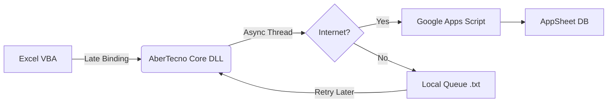

# AberTecno Core

  

**AberTecno Core** is a high-performance COM Middleware designed to bridge Microsoft Excel (VBA) with Cloud Services (Google AppSheet / Apps Script) asynchronously.

It enables Excel macros to log data, track processes, and sync information with the cloud **without freezing the user interface**, ensuring data integrity even in offline scenarios.

---

## 🚀 Key Features

* **Async "Fire & Forget" Architecture:** Offloads HTTP requests to background threads. The Excel UI remains responsive 100% of the time.
* **Offline Tolerance (Store & Forward):** If the internet connection fails, logs are queued locally and automatically synchronized when the connection is restored.
* **Auto-Update Mechanism:** The library checks for updates on startup and self-updates seamlessly using GitHub Releases.
* **Zero-Config Integration:** Uses Late Binding (`CreateObject`). No need to manually add References in the VBA Editor.
* **Thread Safety:** Robust file handling with locking mechanisms to prevent concurrency errors.

## 📦 Installation

This repository contains the distribution binaries and the installer. **Source code is proprietary and hosted in a private repository.**

1.  Download the latest installer from the [Releases Page](https://github.com/TU_USUARIO/AberTecno-Dist/releases).
2.  Run `AberTecnoSetup.exe`.
3.  Follow the wizard instructions (Administrator rights required).
4.  The library is now registered in your system.

## 💻 Usage (VBA)

You can interact with the core library using standard VBA. Since it is a COM Server, you can instantiate it directly.

### 1. Initialization
Place this at the start of your process. It spins up the background threads and checks for pending logs or updates.

```vba
Dim AT As Object
Set AT = CreateObject("AberTecno.Controller")

' Initialize with a unique Flow ID (Optional)
AT.Init "FLOW_100"

' Set with a unique Function ID (Optional)
AT.SetFunction "FUNCTION_100"
```

### 2. Logging Data
Send data to the cloud. This method returns immediately (non-blocking).

```vba
' Log(Start, End, Status, Message)
AT.Log Format(Now, "dd/mm/yyyy hh:mm:ss"), _
       Format(Now, "dd/mm/yyyy hh:mm:ss"), _
       "SUCCESS", _
       "Process completed successfully."
```

### 3. Manual Sync (Optional)
The system syncs automatically on Init and Log, but you can force a sync trigger.

```vba
AT.Sync
```

## ⚙️ Requirements

* **OS:** Windows 10 / 11 (x64 recommended).
* **Software:** Microsoft Excel (2010 or newer).
* **Framework:** .NET Framework 4.7.2 or higher.

## 🛠️ Architecture Overview



---

**© 2026 AberTecno Inc.** | *Developed for internal automation processes.*
